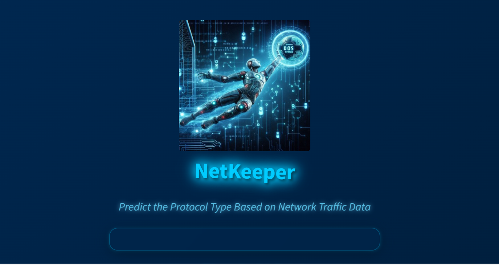
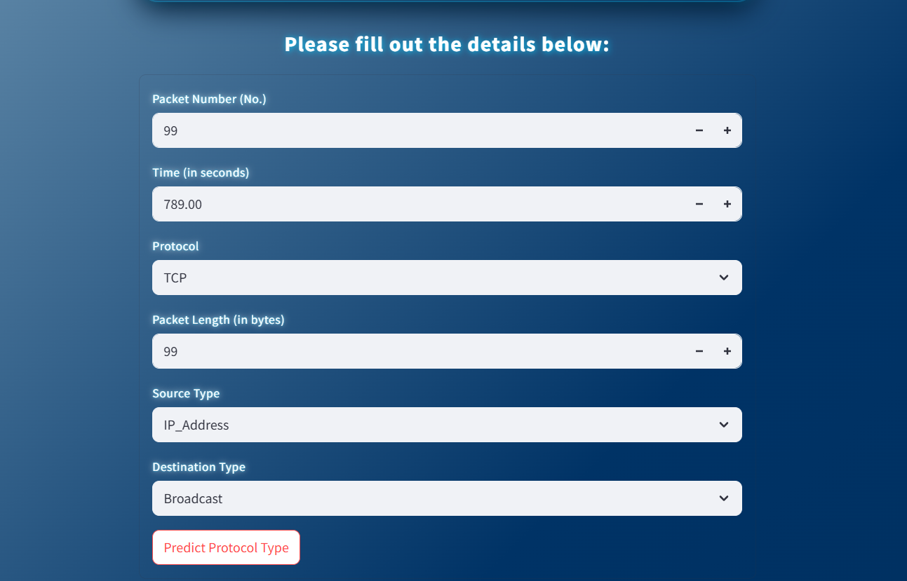
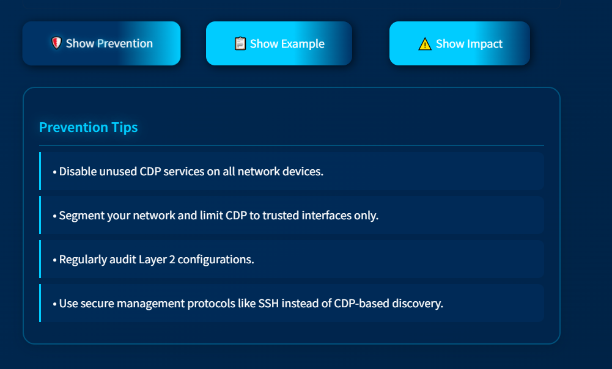
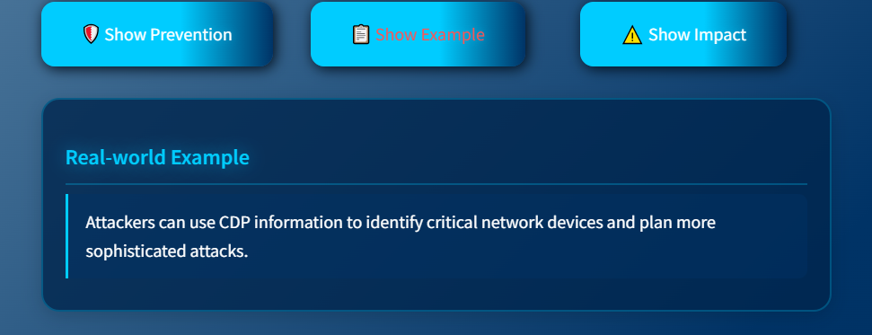

# 🛡️ NetKeeper - Network Security Assistant


## 📝 Overview
NetKeeper is an advanced network security assistant that leverages machine learning to predict and analyze network protocol types based on traffic data. It provides real-time insights into potential network attacks and offers detailed prevention strategies.

## ✨ Features

### 🎯 Attack Detection
- Real-time protocol type prediction
- Detection of various network attacks:
  - CDP (Cisco Discovery Protocol) Attacks
  - OSPF (Open Shortest Path First) Attacks
  - ICMP (Internet Control Message Protocol) Attacks
  - DHCP (Dynamic Host Configuration Protocol) Attacks
  - MAC Flood Attacks

### 🛡️ Security Analysis
- Detailed attack explanations
- Prevention strategies
- Impact analysis
- Real-world attack examples
- Interactive security recommendations

### 💻 User Interface
- Modern glassmorphism design
- Interactive form for data input
- Real-time prediction results
- Audio feedback for predictions
- Responsive and animated components

## 🚀 Getting Started

### Prerequisites
- Python 3.8 or higher
- pip (Python package installer)
- Git

### Installation

1. Clone the repository:
```bash
git clone https://github.com/mohamedelmesery7/Final-graduation-project7.git
cd NetKeeper
```

2. Create and activate a virtual environment:
```bash
python -m venv venv
# On Windows
venv\Scripts\activate
# On Unix or MacOS
source venv/bin/activate
```

3. Install dependencies:
```bash
pip install -r requirements.txt
```

### Running the Application

1. Start the Streamlit application:
```bash
streamlit run app.py
```

2. Open your web browser and navigate to:
```
http://localhost:8501
```

## 📊 Usage

1. Input Network Data:
   - Packet Number
   - Time (in seconds)
   - Protocol Type
   - Packet Length
   - Source Type
   - Destination Type

2. Click "Predict Protocol Type" to analyze the data

3. View Results:
   - Prediction outcome
   - Attack type (if detected)
   - Prevention tips
   - Impact analysis
   - Real-world examples

## 🔧 Project Structure and Components

### Core Components

#### 1. Virtual Environment (venv)
- **Purpose**: Isolates Python dependencies for the project
- **Key Features**:
  - Prevents dependency conflicts
  - Allows specific library versions
  - Provides isolated development environment

#### 2. Logger (logger.py)
- **Purpose**: Manages application logging
- **Key Features**:
  - Logs to file and console
  - Multiple log levels (DEBUG, INFO, WARNING, ERROR, CRITICAL)
  - Timestamp and detailed formatting

#### 3. Exception Handler (exception.py)
- **Purpose**: Structured exception handling
- **Key Features**:
  - Detailed error messages
  - Custom exception classes
  - Consistent error reporting

#### 4. Utils (utils.py)
- **Purpose**: Common utility functions
- **Key Features**:
  - Reusable helper methods
  - Data processing utilities
  - Code organization

### Pipeline Components

#### 1. Data Ingestion (data_ingestion.py)
- **Purpose**: Raw data processing
- **Features**:
  - CSV data reading
  - Train-test splitting
  - Data storage management

#### 2. Data Transformation (data_transformation1.py)
- **Purpose**: Data preprocessing
- **Features**:
  - Feature scaling
  - Encoding
  - Missing value handling

#### 3. Model Training (model_trainer.py)
- **Purpose**: ML model training
- **Features**:
  - Model training
  - Performance evaluation
  - Model persistence

#### 4. Prediction Pipeline (predict_pipeline.py)
- **Purpose**: Real-time predictions
- **Features**:
  - Model loading
  - Data preprocessing
  - Prediction generation

### Dependencies (requirements.txt)
- **Core Libraries**:
  - pandas: Data manipulation
  - numpy: Numerical computing
  - scikit-learn: Machine learning
  - catboost: Gradient boosting
  - xgboost: Optimized boosting
  - streamlit: Web interface
  - gTTS: Text-to-speech
  - Flask: Web framework

## 🔐 Security Features
- Input validation and sanitization
- Secure data processing
- Error handling and protection
- Fallback responses for system unavailability

## 📊 Visualizations & Results

NetKeeper provides insightful visualizations and output images to help users understand network traffic and prediction results. Here are some example outputs:

<p align="center">
  
  
</p>
<p align="center">
  
  
</p>

---

## 🚀 App Preview

Below is a preview of the NetKeeper web application interface:

<p align="center">
  
</p>

<p align="center">
  
</p>

---

## 🚀 Deployment

This project is deployed on **Microsoft Azure** using **Azure App Service** and automated with **GitHub Actions** for CI/CD. The deployment workflow ensures that every push to the main branch is automatically built, tested, and deployed to the cloud, providing a seamless and reliable update process.

---

## 👥 Authors
- Mohamed Elmesery - Initial work

## 🙏 Acknowledgments
- Thanks to all contributors who have helped shape this project
- Special thanks to the open-source community for their invaluable tools and libraries